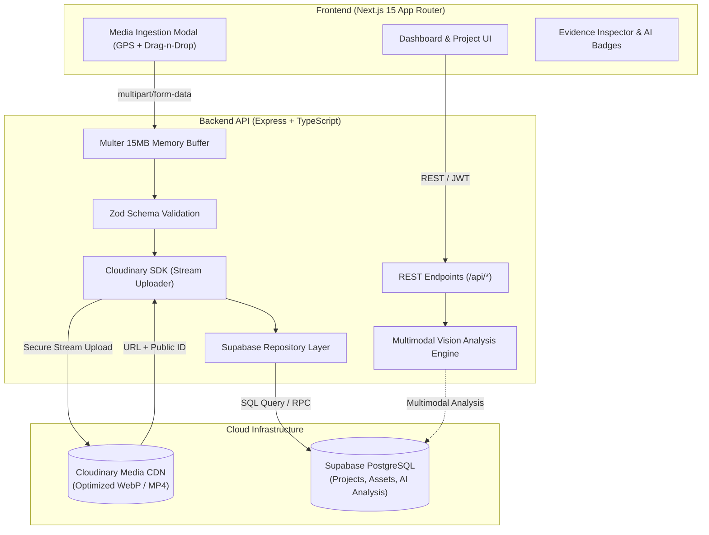
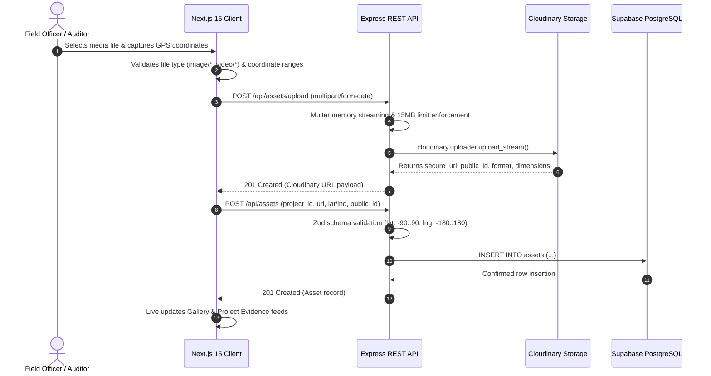

# Vision

An end-to-end media intelligence and verification platform for environmental, social, and sustainability initiatives. Vision ingests field photos and videos, pairs them with tamper-resistant geographic metadata, and verifies physical ground-truth progress through multimodal AI analysis.

[](https://nextjs.org/)
[](https://expressjs.com/)
[](https://www.typescriptlang.org/)
[](https://supabase.com/)
[](https://cloudinary.com/)
[](https://tailwindcss.com/)

---

## Architecture

Vision is decoupled into an autonomous Next.js 15 frontend application, an Express TypeScript REST backend, Cloudinary asset storage, and a Supabase PostgreSQL persistence layer.



---

## Ingestion and Verification Flow

Field teams submit on-site photo or video evidence with real-time GPS metadata. The ingestion pipeline validates the payload, streams it to Cloudinary, indexes it in Supabase, and updates the frontend gallery.



---

## Development Milestones

| Milestone | Scope | Deliverables | Status |
| :--- | :--- | :--- | :--- |
| **Phase 0** | **Core Architecture & Schemas** | Decoupled client/server, project schema, in-memory fallbacks, basic routing | Completed |
| **Phase 1** | **Media Ingestion Pipeline** | Cloudinary integration, GPS capture, drag-and-drop modal, live gallery feeds | Completed |
| **Phase 2** | **AI Vision Analysis** | Multimodal structured JSON extraction, resilient multi-model fallback chain, automated tagging, Visual Evidence Inspector | Completed |
| **Phase 3** | **Vector Search & Similarity** | pgvector embeddings, duplicate detection, cross-project semantic queries | Planned |
| **Phase 4** | **ESG Impact Reports** | Metric aggregation, PDF report generation, public verification share links | Planned |

---

## Phase 2: AI Vision Analysis Capabilities

- **Multimodal Ground-Truth Verification**: Inspects uploaded photographic and video evidence through multimodal vision intelligence, automatically detecting verifiable environmental markers, activities, and physical conditions.
- **Resilient Fallback & Backoff**: Automatically handles upstream provider capacity spikes with bounded jittered exponential backoff and multi-model candidate failover.
- **Fail-Safe Diagnostics**: Upstream provider credential errors (`401`/`403`) are isolated server-side and mapped to `502 Bad Gateway`, safeguarding application client authentication state.
- **Evidence Inspector Modal**: Detailed visual drawer in the frontend with confidence scores, identified physical objects, sustainability activities, condition assessments, and interactive Google Maps GPS pins.
- **Provenance & Auditability**: Every inspection records provenance tracking (`source: 'gemini' | 'simulated'`) and prevents N+1 query overhead via asset-batched retrieval.

---

## Quickstart

### Prerequisites
- Node.js `v18.x` or higher
- npm `v9.x` or higher

### 1. Installation

Install both backend and frontend dependencies from the root repository:

```bash
git clone https://github.com/Swatantra-66/Vision.git
cd Vision
npm run install:all
```

### 2. Environment Configuration

#### Backend (`backend/.env`):
```env
PORT=5000
NODE_ENV=development
FRONTEND_URL=http://localhost:3000

# Supabase
SUPABASE_URL=https://your-project-id.supabase.co
SUPABASE_SERVICE_ROLE_KEY=eyJhbGciOi...

# Cloudinary
CLOUDINARY_CLOUD_NAME=your_cloud_name
CLOUDINARY_API_KEY=your_api_key
CLOUDINARY_API_SECRET=your_api_secret

# Vision AI Configuration
GEMINI_API_KEY=your_api_key
GEMINI_MODEL=gemini-3.8-flash
```

#### Frontend (`frontend/.env.local`):
```env
NEXT_PUBLIC_API_URL=http://localhost:5000/api
NEXT_PUBLIC_SUPABASE_URL=https://your-project-id.supabase.co
NEXT_PUBLIC_SUPABASE_ANON_KEY=eyJhbGciOi...
```

*Note: If cloud credentials are not provided, the backend falls back to an internal in-memory store and intelligent contextual simulation for local testing.*

### 3. Running Locally

Run both the backend API (`:5000`) and the Next.js frontend (`:3000`) concurrently:

```bash
npm run dev
```

- Frontend: `http://localhost:3000`
- Backend Health Check: `http://localhost:5000/api/health`
- Media Gallery: `http://localhost:3000/media`

---

## REST API Reference

| Method | Endpoint | Description | Payload / Parameters |
| :--- | :--- | :--- | :--- |
| `GET` | `/api/health` | Service health status check | None |
| `GET` | `/api/projects` | List active projects | Filter query params |
| `GET` | `/api/projects/:id` | Get project detail and metrics | `id: UUID` |
| `POST` | `/api/assets/upload` | Stream image or video to Cloudinary | `multipart/form-data` (`file`) |
| `POST` | `/api/assets` | Register uploaded asset in database | `{ project_id, url, latitude, longitude, ... }` |
| `GET` | `/api/assets` | List ingested media assets | `?projectId=:id` |
| `POST` | `/api/assets/:id/analyze` | Execute automated AI Vision multimodal inspection | `id: UUID` |
| `GET` | `/api/assets/:id/analysis` | Fetch existing AI evidence analysis for an asset | `id: UUID` |

---

## Database Schema

The platform uses PostgreSQL via Supabase. Schema definitions are maintained in [`backend/schema.sql`](backend/schema.sql):

- **`projects`**: Project titles, descriptions, sustainability categories, locations, target goals.
- **`assets`**: Cloudinary URLs, public IDs, file types, GPS coordinates (latitude/longitude), upload timestamps.
- **`ai_analysis`**: Structured multimodal outputs (description, detected objects, activities, scene classifications, physical conditions, confidence metrics, source provenance).

---

## Contributors

- **Sarthak Pandey** ([@Sarthak-Pandey](https://github.com/Sarthak-Pandey))
- **Swatantra** ([@Swatantra-66](https://github.com/Swatantra-66))
