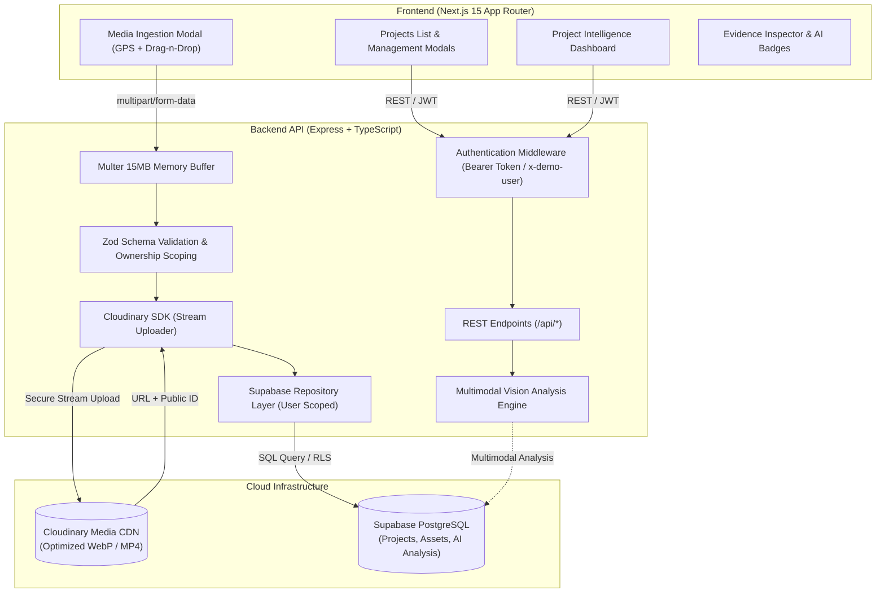

# Vision

An end-to-end media intelligence and verification platform for environmental, social, and sustainability initiatives. Vision ingests field photos and videos, pairs them with geographic metadata, and verifies physical ground-truth progress through multimodal AI analysis and project-centric evidence dashboards.

[](https://nextjs.org/)
[](https://expressjs.com/)
[](https://www.typescriptlang.org/)
[](https://supabase.com/)
[](https://cloudinary.com/)
[](https://tailwindcss.com/)

---

## Architecture

Vision is decoupled into an autonomous Next.js 15 frontend application, an Express TypeScript REST backend with strict Zod schemas, Cloudinary asset storage, and a Supabase PostgreSQL persistence layer.



---

## Development Milestones

| Milestone | Scope | Deliverables | Status |
| :--- | :--- | :--- | :--- |
| **Phase 0** | **Core Architecture & Schemas** | Decoupled client/server, project schema, in-memory fallbacks, basic routing | Completed |
| **Phase 1** | **Media Ingestion Pipeline** | Cloudinary integration, GPS capture, drag-and-drop modal, live gallery feeds | Completed |
| **Phase 2** | **AI Vision Analysis** | Multimodal structured JSON extraction, resilient multi-model fallback chain, automated tagging, Visual Evidence Inspector | Completed |
| **Phase 3** | **Project Management & Dashboard** | Project creation, editing, deletion, real-time statistics, chronological timeline, activity breakdown, geo-clustering, multi-tenant security controls | Completed |
| **Phase 4** | **Semantic Image Search** | Multimodal image/query embeddings, PostgreSQL pgvector HNSW indexing, project-scoped similarity search UI | Completed |
| **Phase 5** | **Before / After Intelligence** | Observable visual change comparison, duplicate prevention, chronological validation, side-by-side evidence UI | Completed |
| **Phase 6** | **Evidence & Traceability** | Observable AI claims linked to verified original media, dual-source extraction (Phase 2 & Phase 5), deterministic deduplication, RLS/IDOR protection, Audit & Traceability UI | Completed |
| **Phase 7** | **Evidence Gap Detection** | Rule-based expectation taxonomy, mathematical gap calculation (expected - available), project-type requirements, coverage telemetry, actionable collection suggestions | Completed |
| **Phase 8** | **Evidence Confidence System** | Deterministic 5-signal composite heuristic score (Vision 40%, Metadata 20%, Image Quality 15%, Cross-Asset 15%, Temporal 10%), weight normalization, explainable breakdown UI | Completed |
| **Phase 9** | **ESG Impact Reports** | Metric aggregation, PDF report generation, public verification share links | Planned |

---

## Key Features

### Phase 8: Evidence Confidence System

- **Deterministic Multi-Signal Composite Engine**: Computes an explainable MVP composite score evaluating evidence signal strength without invoking additional AI models or uncalibrated probabilities:
  $$\text{Final Confidence} = \frac{\sum (\text{signal}_i \times \text{weight}_i)}{\sum \text{available weights}}$$
- **Centralized MVP Heuristic Weight Configuration**:
  - **Vision Confidence (40%)**: Extracted from Phase 2 multimodal image analyses and Phase 5 Before/After visual change scores.
  - **Metadata Consistency (20%)**: Verifies internal coherence across geographic GPS coordinate site boundaries, valid media types, and project ownership bounds.
  - **Image Quality (15%)**: Evaluates asset readability, resolution indicators, secure CDN delivery, and format suitability.
  - **Cross-Asset Agreement (15%)**: Corroborates directional consistency across multiple project evidence assets and comparisons without penalizing single-photo claims.
  - **Temporal Consistency (10%)**: Strictly validates chronological progression (`before <= after`) and intervention timeline alignment.
- **Robust Missing-Signal Normalization**: Missing metadata or single-photo records do not score as zero or false; instead, weights are normalized over available signals to prevent penalizing incomplete records.
- **Deterministic 3-Tier Classification**:
  - `score < 40` $\rightarrow$ **LOW** (*Review source evidence before relying on this observation*)
  - `40 <= score < 70` $\rightarrow$ **MEDIUM** (*Some evidence signals are mixed or limited*)
  - `score >= 70` $\rightarrow$ **HIGH** (*Strong agreement across currently available evidence signals*)
- **Explainable Multi-Signal Breakdown UI**: Compact pill badges and expandable 5-signal telemetry cards displaying component percentages, evaluated weights sum, and clear contextual guidance.
- **Mandatory MVP Heuristic Transparency Disclaimer**:
  > *"Composite MVP heuristic based on available evidence signals. Not a scientifically validated probability."*

### Phase 7: Evidence Gap Detection

- **Deterministic Rule-Based Engine**: Replaces speculative AI decision-making with explainable set-difference rules:
  $$\text{Expected Evidence} - \text{Available Evidence} = \text{Missing Evidence}$$
- **Fixed Intervention Taxonomy**: Standardized across 6 stable categories:
  `initial_condition`, `activity`, `immediate_result`, `long_term_outcome`, `beneficiary_evidence`, `quantitative_measurement`.
- **Configured Project Types**: Rule profiles for `tree_plantation` (6/6), `river_restoration` (6/6), `solar_installation` (5/6), and `waste_cleanup` (5/6). Gracefully handles custom/unconfigured types without fabricating arbitrary requirements.
- **Multi-Source Evidence Derivation**: Automatically maps Phase 2 single-photo analyses and Phase 5 Before/After comparisons to qualifying evidence categories.
- **Strict Conservative Guardrails**:
  - Distinguishes visual observations from quantitative measurements (images alone never satisfy `quantitative_measurement`).
  - Distinguishes visible persons from verified social outcomes (images containing people never automatically satisfy `beneficiary_evidence`).
  - Distinguishes immediate post-work conditions from sustained multi-month ecological recovery (`long_term_outcome`).
- **Interactive Evidence Coverage Dashboard**: Two-column layout (*Evidence Available* vs. *Evidence Gaps*), coverage telemetry percentage, supporting media tray with instant inspector modals, and actionable *"Suggested next collection"* guidance.

### Phase 6: Evidence & Traceability

- **End-to-End Visual Auditability**: Establishes a verifiable chain of custody:
  `AI OBSERVATION → CLAIM → EVIDENCE ASSET IDs → ASSET RECORDS → CLOUDINARY → ORIGINAL MEDIA`
  Ensures every AI claim is backed by the exact high-resolution field photos that produced it.
- **Dual-Source Observation Extraction**:
  - **Source 1 (Phase 2 Vision)**: Direct observable activities, conditions, and evidence statements extracted from single-photo AI analysis linked directly to that asset.
  - **Source 2 (Phase 5 Before/After)**: Verified physical changes (vegetation, erosion, waste reduction) extracted from comparisons and linked to both the Before and After assets.
- **Strict Anti-Hallucination & Evidence Invariants**: Rejects any claim with 0 evidence assets. Validates confidence strictly in the range $0 \le c \le 1$. Prohibits unsubstantiated scientific extrapolation (e.g. no fabricated carbon sequestration % or chemical metrics).
- **Deterministic Claim Deduplication**: Normalizes claim text (`trim`, lowercase, whitespace collapse) and enforces a unique constraint on `(project_id, source_type, source_id, normalized_claim)` so background retries remain 100% idempotent.
- **Multi-Tenant Security & IDOR Protection**: Server-side project ownership checks prevent cross-project asset references and reject attempts to access evidence across tenants.
- **Interactive Evidence & Claims Dashboard**: Filterable claims view (`All`, `AI Vision Analysis`, `Before/After Comparisons`, `Low Confidence`), real-time telemetry metrics (total claims, evidence-backed count, average confidence, source breakdown), expandable audit records, and instant one-click media inspection.

- **Multimodal Visual Comparison Engine**: Powered by Google Gemini Vision (`gemini-3.8-flash`) inspecting two ground-truth field photos from the same project to detect observable physical changes (vegetation, visible waste, water appearance, land stability, infrastructure, human activity).
- **Strict Visual Verification Guarantees**: Restricts output strictly to visible photographic differences. Prohibits unsupported scientific claims (no fabricated carbon reduction %, biodiversity %, or chemical water purity metrics).
- **Duplicate Comparison Prevention**: Checks unique composite index `(project_id, before_asset_id, after_asset_id)` in PostgreSQL before invoking AI models, returning existing saved records to eliminate unnecessary AI API costs.
- **Chronological & Asset Safety**: Verifies that both assets belong to the authorized project, ensures both are valid images, guards image streaming with a 15-second timeout and 20MB ceiling, and flags reverse-chronological dates (`before > after`).
- **Interactive Before / After UI**: Embedded directly into project dashboards with dual-photo picker, swap controls, chronological warnings, side-by-side comparison previews, observable change cards with direction badges, model confidence rating, and saved comparisons history.

### Phase 4: Semantic Image Search (pgvector)


- **Multimodal Image Vector Representation**: Generates 1536-dimensional embeddings directly from raw photographic evidence into a shared multimodal vector space (`gemini-embedding-2`), allowing users to search visual evidence using natural language queries rather than manually assigned keywords.
- **In-Database Similarity Search (PostgreSQL + pgvector)**: Runs sub-millisecond cosine similarity queries inside PostgreSQL using an HNSW index (`vector_cosine_ops`) and stored `match_assets` RPC, eliminating costly client-side vector transfers.
- **Strict Project Authorization & Multi-Tenant Scoping**: All search requests require authentication and enforce server-side project ownership, strictly preventing cross-tenant vector leakage.
- **Automated Ingestion Pipeline & Safe Idempotent Backfill**: Automatically triggers background embedding generation for newly uploaded assets without blocking response times. Existing assets are indexed safely without risk of duplication or asset deletion.
- **Interactive Semantic Discovery UI**: Dedicated AI Search tab in the project dashboard equipped with prompt suggestion chips (*"workers planting trees"*, *"river restoration"*), match similarity rankings, real-time indexing status telemetry, and direct visual evidence modal inspection.

### Phase 3: Project Management & Intelligence Dashboard

- **Project Management System**: Create, edit, and safely delete real-world impact projects with strict client and server validation (name, location, description, and date ranges).
- **Multi-Tenant Security Controls**:
  - **Authentication Middleware**: Requires valid `Bearer` token or explicit `x-demo-user` credentials, returning `401 Unauthorized` when credentials are missing.
  - **Server-Side Ownership Scoping**: Enforces `created_by = userId` filtering across project, asset, and AI analysis endpoints to prevent IDOR URL tampering data leaks.
  - **Attacker-Controlled `created_by` Protection**: Client-supplied owner fields in request payloads are safely overridden server-side with the authenticated user ID.
- **Project Intelligence Dashboard**:
  - **Real-Time Statistics**: Dynamic Media Count, Activity Count, and Geo-Location Count cards.
  - **Activity Breakdown**: Case-insensitive normalization of AI vision activities (e.g. `tree plantation`, `Tree Plantation`), attributing assets across distinct categories without double-counting in total media counts.
  - **Geo-Location Site Clustering**: Validates coordinate boundaries (-90..90 lat, -180..180 lng) and groups operational sites at 0.001 degree precision (~110m accuracy).
  - **Chronological Evidence Timeline**: Groups project assets by Year → Month using `capture_date` (fallback `created_at`), transparently highlighting undated assets.
  - **Recent Media Evidence**: Displays recent project thumbnails with video indicators and broken URL fallback UI.

### Phase 2: AI Vision Analysis Capabilities

- **Multimodal Ground-Truth Verification**: Inspects uploaded photographic and video evidence through multimodal vision intelligence, automatically detecting verifiable environmental markers, activities, and physical conditions.
- **Resilient Fallback & Backoff**: Automatically handles upstream provider capacity spikes with bounded jittered exponential backoff and multi-model candidate failover.
- **Fail-Safe Diagnostics**: Upstream provider credential errors (`401`/`403`) are isolated server-side and mapped to `502 Bad Gateway`, safeguarding application client authentication state.
- **Evidence Inspector Modal**: Detailed visual drawer in the frontend with confidence scores, identified physical objects, sustainability activities, condition assessments, and interactive GPS coordinate details.

---

## Quickstart

### Prerequisites
- Node.js `v18.x` or higher
- npm `v9.x` or higher

### 1. Installation

Install both backend and frontend dependencies from the root repository:

```bash
git clone https://github.com/Sarthak-Pandey/Vision.git
cd Vision
npm run install:all
```

### 2. Environment Configuration

#### Backend (`backend/.env`):
```env
PORT=5000
NODE_ENV=development
FRONTEND_URL=http://localhost:3000

# Supabase
SUPABASE_URL=https://your-project-id.supabase.co
SUPABASE_SERVICE_ROLE_KEY=eyJhbGciOi...

# Cloudinary
CLOUDINARY_CLOUD_NAME=your_cloud_name
CLOUDINARY_API_KEY=your_api_key
CLOUDINARY_API_SECRET=your_api_secret

# Vision AI Configuration
GEMINI_API_KEY=your_api_key
GEMINI_MODEL=gemini-3.8-flash
```

#### Frontend (`frontend/.env.local`):
```env
NEXT_PUBLIC_API_URL=http://localhost:5000/api
NEXT_PUBLIC_SUPABASE_URL=https://your-project-id.supabase.co
NEXT_PUBLIC_SUPABASE_ANON_KEY=eyJhbGciOi...
```

*Note: If cloud credentials are not provided, the backend falls back to an internal in-memory store and intelligent contextual simulation for local testing.*

### 3. Running Locally

Run both the backend API (`:5000`) and the Next.js frontend (`:3000`) concurrently:

```bash
npm run dev
```

- Frontend: `http://localhost:3000`
- Backend Health Check: `http://localhost:5000/api/health`
- Projects List: `http://localhost:3000/projects`

---

## REST API Reference

| Method | Endpoint | Description | Headers / Payload |
| :--- | :--- | :--- | :--- |
| `GET` | `/api/health` | Service health status check | None |
| `GET` | `/api/projects` | List projects owned by authenticated user | `Authorization` or `x-demo-user` |
| `POST` | `/api/projects` | Create a new project | `{ name, description, location, start_date, end_date }` |
| `GET` | `/api/projects/:id` | Get project details and statistics | `id: UUID` |
| `PATCH` | `/api/projects/:id` | Update project details | `{ name, description, location, ... }` |
| `DELETE` | `/api/projects/:id` | Delete project and cascade assets | `id: UUID` |
| `POST` | `/api/assets/upload` | Stream image or video to Cloudinary | `multipart/form-data` (`file`) |
| `POST` | `/api/assets` | Register uploaded asset in database | `{ project_id, url, latitude, longitude, ... }` |
| `GET` | `/api/assets` | List ingested media assets for project | `?projectId=:id` |
| `POST` | `/api/assets/:id/analyze` | Execute automated AI Vision multimodal inspection | `id: UUID` |
| `GET` | `/api/assets/:id/analysis` | Fetch existing AI evidence analysis for an asset | `id: UUID` |
| `POST` | `/api/search` | Multimodal semantic natural language image search | `{ projectId, query, threshold, limit }` |
| `POST` | `/api/search/index` | Backfill embedding generation for unindexed images | `{ projectId, batchSize }` |
| `GET` | `/api/search/stats` | Telemetry stats for indexed image coverage | `?projectId=:id` |
| `POST` | `/api/projects/:projectId/comparisons` | Run or retrieve Before/After AI visual comparison | `{ beforeAssetId, afterAssetId }` |
| `GET` | `/api/projects/:projectId/comparisons` | List saved comparisons for project | `projectId: UUID` |
| `GET` | `/api/projects/:projectId/comparisons/:id` | Get specific comparison result by ID | `projectId: UUID, id: UUID` |
| `GET` | `/api/projects/:projectId/claims` | List project claims with telemetry and source filtering | `?sourceType=&minConfidence=&limit=` |
| `GET` | `/api/projects/:projectId/claims/:claimId` | Get single claim with hydrated evidence media assets | `projectId: UUID, claimId: UUID` |
| `POST` | `/api/projects/:projectId/claims` | Create a verified evidence-backed claim | `{ claim, confidence, sourceType, evidenceAssetIds }` |
| `POST` | `/api/projects/:projectId/claims/sync` | Extract and sync claims from all project media & comparisons | `projectId: UUID` |
| `GET` | `/api/projects/:projectId/evidence-gaps` | Evaluate expected vs available evidence and detect gaps | `projectId: UUID` |
| `GET` | `/api/projects/:projectId/confidence` | Get project-level composite confidence telemetry and breakdown | `projectId: UUID` |
| `POST` | `/api/projects/:projectId/confidence/calculate` | Test composite confidence calculation from custom signals | `{ signals: ConfidenceSignals }` |

---

## Database Schema

The platform uses PostgreSQL via Supabase. Schema definitions are maintained in [`backend/schema.sql`](backend/schema.sql):

- **`projects`**: Project names, descriptions, locations, start/end dates, `created_by` owner IDs, creation timestamps.
- **`assets`**: Cloudinary URLs, public IDs, file types, GPS coordinates (latitude/longitude), upload timestamps, foreign key `project_id REFERENCES projects(id) ON DELETE CASCADE`.
- **`ai_analysis`**: Multimodal outputs (description, detected objects, activities, scene classifications, physical conditions, confidence metrics, source provenance), foreign key `asset_id REFERENCES assets(id) ON DELETE CASCADE`.
- **`embeddings`**: 1536-dimensional multimodal vectors for images, HNSW cosine index `vector_cosine_ops`, foreign key `asset_id REFERENCES assets(id) ON DELETE CASCADE`.
- **`comparisons`**: Structured Before/After visual comparison results, confidence scores, models, foreign keys `project_id REFERENCES projects(id)`, `before_asset_id REFERENCES assets(id)`, `after_asset_id REFERENCES assets(id)` on delete cascade, unique constraint on `(project_id, before_asset_id, after_asset_id)`.
- **`evidence_claims`**: Observable claims, confidence scores, source types (`asset_analysis`, `comparison`, `manual`), source IDs, normalized statement key, created by identity, timestamps, unique constraint on `(project_id, source_type, source_id, normalized_claim)`.
- **`claim_evidence`**: Junction table linking `claim_id REFERENCES evidence_claims(id)` to `asset_id REFERENCES assets(id)` on delete cascade, with composite primary key `(claim_id, asset_id)` preventing duplicate evidence associations.


---

## Contributors

- **Sarthak Pandey** ([@Sarthak-Pandey](https://github.com/Sarthak-Pandey))
- **Swatantra** ([@Swatantra-66](https://github.com/Swatantra-66))
